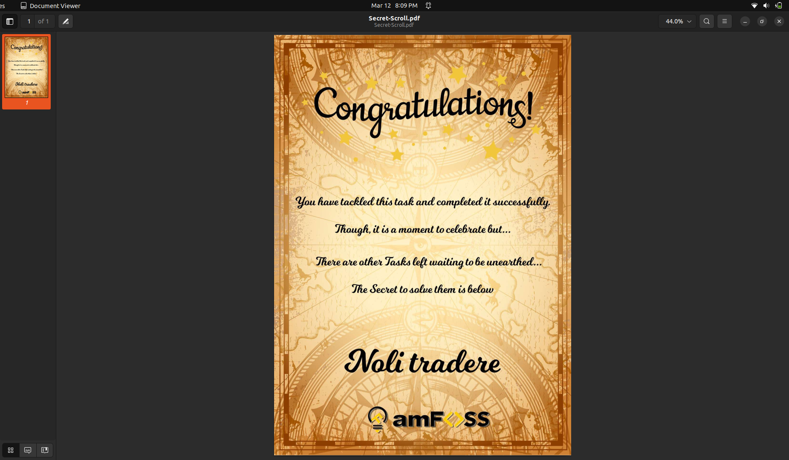

# Terminal Hunt
Completing this task has been a great learning experience for me to become familiar with the git commands.


Intially, I found the concepts of git and GitHub very confusing. So when I was going through the task, it sort of clicked right into its place.


Therefore for me the task was both informative and enjoyable, neither too easy nor too challenging.


Overall, I found this task to be a valuable and worthwile experience.


The first git command I used was obviously the command mentioned in the [Terminal Hunt](https://github.com/gauthamk02/TerminalHunt) repository.
```bash
git clone https://github.com/gauthamk02/TerminalHunt.git
```
After that I used
```bash
ls
```
to list out my directories.
Then I used
```bash
cd TerminalHunt
```
to navigate to the directory where I created the solution directory using the command
```bash
mkdir solution
```
The answer for part1 of the exercise was pretty much easy to find.
Then I used the text editor nano for creatiing the part1.txt
```bash
nano part1.txt
```
and after wiriting the answer, the file was written using >Ctrl+O<
For the next part,
after finding the answer, I navigated into the Folder 06 of the TerminalHunt directory.
Copied the 1.txt using the command
```bash
cp 1.txt ../solution
```
Once again went back in to the solution directory and renamed the 1.txt into part2.txt using
```bash
mv 1.txt part2.txt
```
I believe the most valuable learning experience during the exercise occured when I began working on part3 or second-half of the exercise
Commit log of the repo was viewed through 
```bash
git log
```
Then I copied and renamed the required file using the above mentioned steps.
I added all the files to the staging are using
```bash
git add .
```
Commited the changes by running the command
```bash
git commint -m "My Intial commit"
```
After that I used
```bash
git branch -a
```
and used the command
```bash
git checkout asia
```
to switch to the branch asia.
And find the last answer using the the command
```bash
find . -name athens.txt
```
Merging the branch asia to main was easy enough
```bash
git checkout main
git merge asia
```
Then I copied and renamed the athens.txt file into the solution directory as part4.txt

Then i concatenated the files in the solution directory using the
```bash
cat part1.txt part2.txt part3.txt part4.txt > password.txt
```
and deleted the files except password.txt using 
```bash
rm part1.txt part2.txt part3.txt part4.txt
```
Finally I Once again commited the changes using
```bash
git add .
```
```bash
git commit -m "My second commit"
```
Screenshot of the pdf

